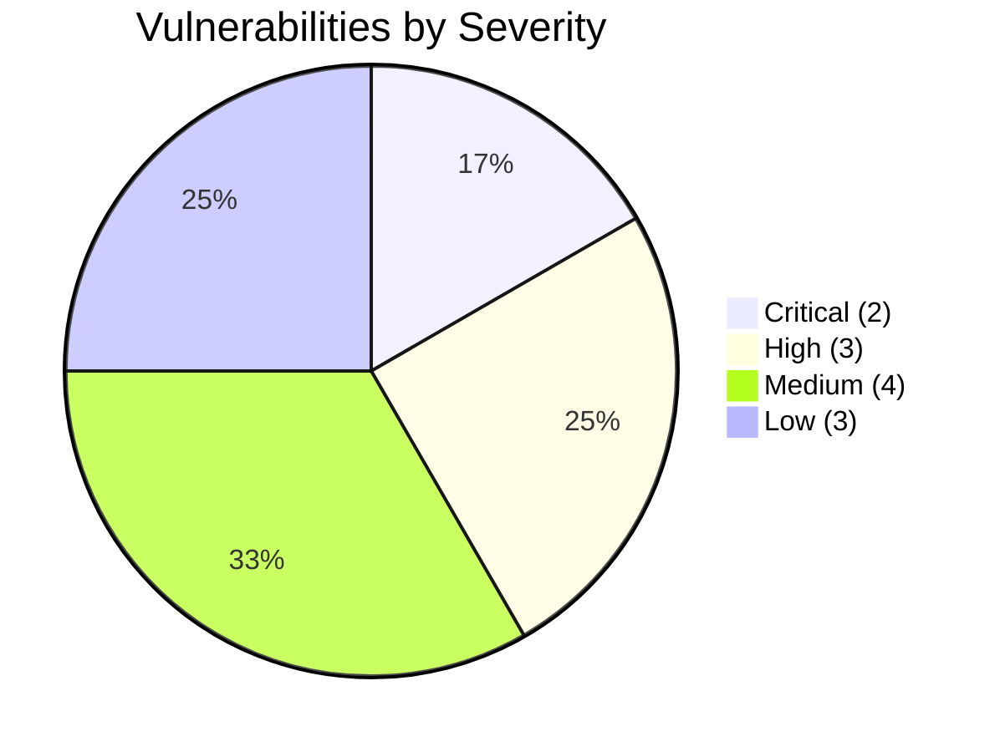

# Executive Summary — Security Assessment & Penetration Audit

**Target Application:** Maxillofacial Implant Survival Predictor (`ImplantAI` Platform)  
**Technology Stack:** Python 3.14, Flask 3.1.3, SQLAlchemy 2.0, SQLite / Firebase Firestore  
**Assessment Type:** Full-Scope Backend SAST, DAST, API Discovery & Dependency Review  
**Assessment Date:** 2026-08-17  
**Lead Security Engineer:** Senior Application Security & DevSecOps Specialist  

---

## 🛡️ Overall Security Posture

```
┌────────────────────────────────────────────────────────┐
│             OVERALL SECURITY SCORE: 78 / 100           │
│             RISK POSTURE: MODERATE (REMEDIABLE)        │
└────────────────────────────────────────────────────────┘
```

The application demonstrates good domain-level controls in clinical data segregation, role scoping per doctor, and parameterized SQL queries through SQLAlchemy ORM. However, critical cryptographic and configuration vulnerabilities were identified—chiefly **plaintext password storage** and **unthrottled authentication/OTP endpoints**—which must be remediated prior to clinical production deployment.

---

## 📊 Summary of Vulnerability Findings

| Severity Level | Count | Immediate Action Required |
| :--- | :---: | :--- |
| 🔴 **CRITICAL** | **2** | Immediate patch required before production exposure |
| 🟠 **HIGH** | **3** | Patch required in next release sprint |
| 🟡 **MEDIUM** | **4** | Scheduled remediation & defense-in-depth hardening |
| 🔵 **LOW / INFORMATIONAL** | **3** | Best-practice hardening & configuration tuning |
| **TOTAL FINDINGS** | **12** | Complete remediation roadmap provided |

---

## 🚨 Top 3 Critical Risks & Business Impact

### 1. Plaintext Password Storage in SQLite Backend (`CWE-256 / CWE-312`)
* **Vulnerability:** User passwords are stored as raw plaintext strings in the `User` table without cryptographic hashing (e.g. bcrypt, Argon2id, or Werkzeug pbkdf2:sha256).
* **Impact:** In the event of unauthorized database file access or backup compromise, 100% of user credentials would be directly exposed in plaintext.
* **Remediation:** Implement `werkzeug.security.generate_password_hash` and `check_password_hash`.

### 2. Missing Rate Limiting on Login & 6-Digit OTP Verification (`CWE-307 / CWE-799`)
* **Vulnerability:** The endpoints `/auth/login`, `/auth/send_otp`, and `/auth/verify_otp` lack request rate-limiting / throttling.
* **Impact:** An attacker can perform automated brute-force attacks against doctor login passwords and brute-force the 6-digit numeric OTP space ($10^6$ combinations) within the 10-minute validity window.
* **Remediation:** Integrate `Flask-Limiter` with IP/User key limits (e.g., 5 attempts / minute).

### 3. Debug Mode Enabled on Public Interface (`CWE-215 / CWE-489`)
* **Vulnerability:** `app.run(host='0.0.0.0', port=5000, debug=True)` is enabled in the entry point.
* **Impact:** Werkzeug interactive debugger exposes verbose internal traceback details and an interactive console pin prompt that could lead to Remote Code Execution (RCE).
* **Remediation:** Force `debug=False` when running in production and bind using production WSGI server (Gunicorn / Waitress).

---

## 📋 Remediation Priority Matrix



---

## 📑 Assessment Artifacts Generated

1. [`security-review.md`](file:///c:/Users/kuruv/OneDrive/Documents/PDD_project_anti/Vulnerability%20Test%20Results/security-review.md) — Comprehensive technical vulnerability descriptions, theoretical exploit scenarios, and code patches.
2. [`dependency-report.md`](file:///c:/Users/kuruv/OneDrive/Documents/PDD_project_anti/Vulnerability%20Test%20Results/dependency-report.md) — Software Bill of Materials (SBOM) and supply-chain CVE analysis.
3. [`findings.xlsx`](file:///c:/Users/kuruv/OneDrive/Documents/PDD_project_anti/Vulnerability%20Test%20Results/findings.xlsx) — Excel workbook containing Security Findings, Endpoint Inventory, and Risk Summary.
4. [`.github/workflows/security-review.yml`](file:///c:/Users/kuruv/OneDrive/Documents/PDD_project_anti/.github/workflows/security-review.yml) — Automated DevSecOps CI/CD pipeline.
